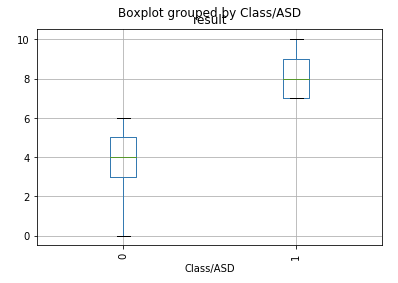
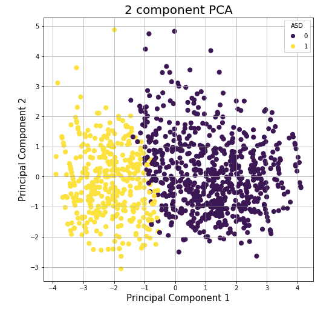
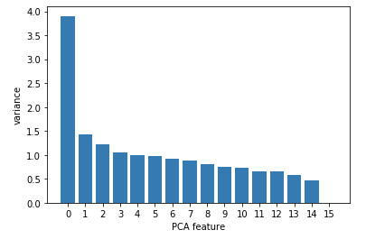
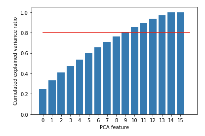
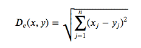
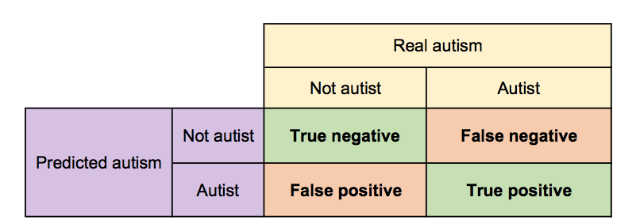
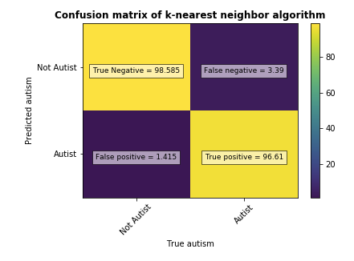

# Machine learning on autism data

## Introduction 

 Pr Fadi Fayez Thabtah, from the Digital Technology Departement of Manukau Institute of Technology of Auckland has created an app, the Autism Spectrum Disorder Tests App, aiming at understanding the main characteristics of autistic patients in order to better detect ASD. By answering a series of 10 questions, and giving a few information about themselves, users of the app have contributed in creating datasets related to autism. It has been divided in three parts : children (from 4 to 11 years old), adolescents (12 to 18 years old), and adults. 

These datasets are the starting for this project of machine learning, aiming at creating an algorithm that detect autism from the responses to those 10 questions. 

I here present my strategy to build this algorithm. The code is available in the Jupyter Notebook "project.iynb". The data set are the three arff files available in the file. 

## 1. Importing the recquired modules

arff is important to load the arff files. I also load commmon modules such as pandas, numpy and matplotlib.pyplot. I then import several sklearn functions. Scikit-learn is a pre-defined package of Python made for machine learning.

## 2. Loading the data

The data is arff files, which contain two parts : one with metadata, and one with data. The first 10 columns are  responses to 10 different questions about their life habits. The results of the questions is summarized in the result variable, a score relative to the number of yes answers. 
 
 

 

We also have data about the person : gender, ethnicity, jundice when he was young, country, age, whether one parent have a ASD-like trouble ('austim')... We also know if the child is autistic or not ('Class/ASD'). We also have a few information about the person responding the questionnaire (its relation to the child, its use of the app before etc.). 

The data set are loaded as data_child, data_ado and data_adult.

## 3. Handling missing values

I want to handle missing values by replacing it by their mean. I want to to this before merging the different data sets because I hypothesis that some variables are very different from a child to an adult. Therefore, I search for missing values and handle it before merging the datasets. Missing values are found in the age variable : I replace them by the mean of their category (mean age of children, mean age of adults).

## 4. Merging datasets

We have three different data sets (child, adolescent, adult). I merge them into a single one in order to have more observations and therefore better predictions. 

## 5. Tidying data

We turn string values into numerical values in order to be able to lead a numerical analysis. We only have binary variables, therefore it is easy: 1 codes for Yes and 0 codes for No. For gender, 0 is man and 1 is woman
To simplify the  analysis, I drop the country of residence, the ethnicity and the relation to the person who is answering. I here assume that they have not as much influence than the other data. 

In order for our data set to be ready, I create different arrays: one with target variable (autistic or not, with the variable Class/ASD), and one with all the other variables. We therefore have those variables in X:

| Variable       | Values          | What it corresponds to  |
| :------------- |:-------------:| :-----:|
| A1_Score      | 0 or 1 | Response to question 1 |
| A2_Score      | 0 or 1 | Response to question 2 |
| A3_Score      | 0 or 1 | Response to question 3 |
| A4_Score      | 0 or 1 | Response to question 4 |
| A5_Score      | 0 or 1 | Response to question 5 |
| A6_Score      | 0 or 1 | Response to question 6 |
| A7_Score      | 0 or 1 | Response to question 7 |
| A8_Score      | 0 or 1 | Response to question 8 |
| A9_Score      | 0 or 1 | Response to question 9 |
| A10_Score      | 0 or 1 | Response to question 10 |
| age      | from 4 to 64 | Age of the person |
| gender     | 0 or 1      |   Gender of the person |
| jundice | 0 or 1      |    Corresponds to 1 if the person has had jundice when he/she was a child |
| austim     | 0 or 1 | Corresponds to 1 if someone in the family has had troubles related to autism |
| used_app_before      | 0 or 1 | Corresponds to 1 if the app has already been used for that person |
| result      | from 0 to 10 | Corresponds to the sum of scores of questions 1 to 10 |

## 6. Visualizing the data
### 6.1. Bar plot

I started by plotting the variable result (which equals to the sum of responses to the 10 questions) in function of ASD (autism=0 if the child is not on the spectrum, autism=1 if he is).

 

 
 ### 6.2. Principal Component Analysis

The problem in that visualization is that it allows us only to plot one variable in function of the target variable (autism). I therefore choose to realize a PCA, or Principal Component Analysis, which analyses the principal components in a dataset, in order to reduce dimensionality.

 

 
Here, I see that I can explain a lot with only two components. **But how much does the other components explain ?** 
In order to answer this question, I can do two things :
* **plot how much the component explains variance** : the PCA calculate the weight of every component in the explained variance of the model. It is stored in the explained_variance_ attribute of the PCA (available at pca.explained_variance_). I see that the first component has a huge weight in the explained variance. *But this method does not show us the percentage of total variance.*

 

 
 * **plot the ratio of variance explained by the components** : it is stored in the PCA's explained_variance_ratio_ attribute. I can print it or plot it, as I have done below. If I want to explain autism with a reduced amount of components, I can choose to explain 80% of variance for example, and therefore use only the 10 first components (when the ratio is higher than 0.8). 
 
 

 

 
 ## 7. Testing models

In order to know whether one specific model can predict well our data, I test their implemented version in scikit learn (a Python package with already implemented machine learning algorithm). I will then choose which one I want to implement myself. 

### 7.1. K-Nearest Neighbors

For this classification, K-Nearest Neighbor predicts the value of an observation (autist or not) on the basis of the values of its _k_ closest neighbors. So, if I choose k=6, the algorithm is going to predict the value of one point based on the mean values of its neighbor. If it close to 4 autists and 2 non-autists, it will be classified as autist. 
It gave us a score of 0.98 with raw data and 0.97 for transformed data.

### 7.2. Logistic Regression

With the logistic regression, we have a score of 0.99 but it is a model much more complicated to implement. Therefore, I chose the K-nearest Neighbor, because it still have a good score.

## 8. Implementation of K-Nearest Neighbors

The idea is to classify data on the basis of their euclidian distance to the other points. The euclidian distance is a distance that calculate the square root of the sum of the squared difference between the coordinates of two points:

 

 

The basis of the model is that we are going to look at a certain number _k_ of points close to the point we want to predict the value. Then, we will predict his value based on the mean of the _k_ points close to it.

### 8.1. Fit step

Every machine learning algorithm starts with a step in which we fit the model to the data. In a K-Nearest Neighbors algorithm, there is no real model to fit because each prediction is made on the basis of the training observations. In the fit step, we only store the training data in the X_train and y_train variables. 
We also set the number of neighbors.

### 8.2. Predict step

This is in this step that we predict the values from the training set we have loaded. 
First, we create a "distance" matrix. This is at the beginnning an empty matrix. With a for loop, we calculate the distance between observation _i_ of the test set with the observation _j_ of the train set. 
Then, for every observation in X_test, we compute the mean of the _k_ neighbors. We sort the indexes from the closest to the farest, and then we compute the mean based on the k first indexes. We then round the mean because we want a value that equals 0 or 1 (autistic or not). It is important that we round the mean to the higher value: we prefer to diagnosis someone that is not autist as autist rather than making a mistake by telling someone he's not autist when he is. Therefore, when the mean is 0.5, we prefer to tell that the person is autist (therefore we round the mean to 1). 

### 8.3. Test step

The last step of a machine learning algorithm is the test step: we want to tell whether our model is good or not in predicting. The first step is to calculate the percentage of accurate predictions, therefore the percentage of persons that had been predicted what they really are ($ y_{pred} = y_{test} $).
We obtained a score of 97.87 %.

### Confusion matrix

Another way to tell whether our model is a good model is not looking just at the accurate predictions but to the biases that a model can have. In fact, imagine a data set of 100 observations with only one autist. If the model is always saying that the person is not autist, it will have a 99% accuracy. But is that what we want? It's what a confusion matrix is doing:

 

  

We want especially to look at the proportion of two types of error:
* **_Type I Error or false positives_**: it means that you have predicted that someone is autist when he is not.
* **_Type II Error or false negatives_**: it means that you have predicted that someone is not autist when he is.

In the case of our data set, I chose to minimize the Type II error (that's why I rounded the mean for example).

 

 

 
 Here, I still have more false negatives than false positives. It may be due to one bias of my dataset: I have less autists than people that are not on the spectrum. Therefore, the model, because it is related to the neighbors, much more numerous when it comes to non autist people. 
 
 
 ## My level in programming
 
 Before doing this project in Python, I had only handled data sets with R and Stata. I learned about machine learning and about Python langage at the beginning of this semester. I wanted to implement an algorithm myself to understand better how scikit algorithms work. 
